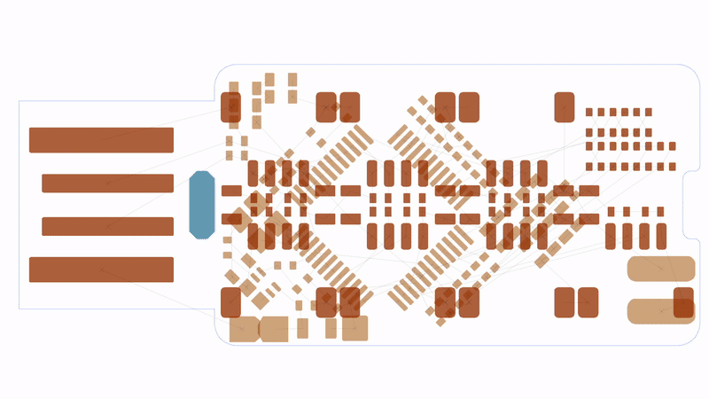
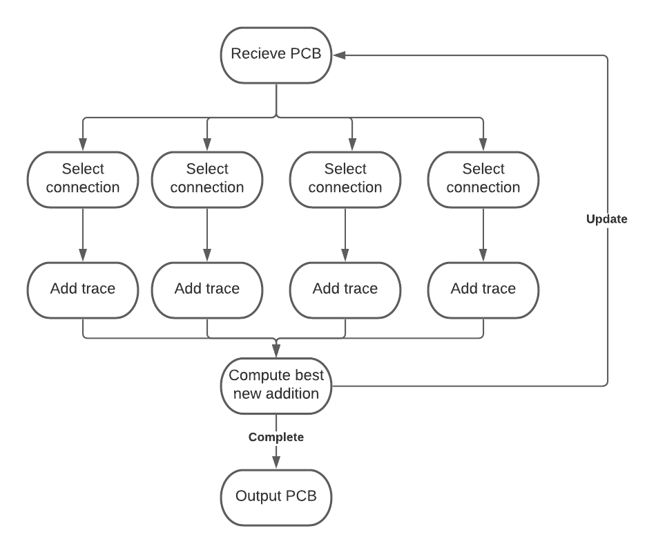

# Parallelized PCB Routing
 
This project aims improve the quality of automatic printed circuit board routing by parralelizing each step and continuously selecting the best results.

### Autorouter
This project uses [freerouting](https://github.com/freerouting/freerouting), an open source autorouting project, to perform each iteration.

A significant issue with the current implementation id that the router tries to select the best connection to route and will only route one connection at a time. This is prone to error and depending on the order traces are routed the routing may fail. This project will help mitigate this issue by having multiple traces routed at the same time before deciding the best path.

### Overview

