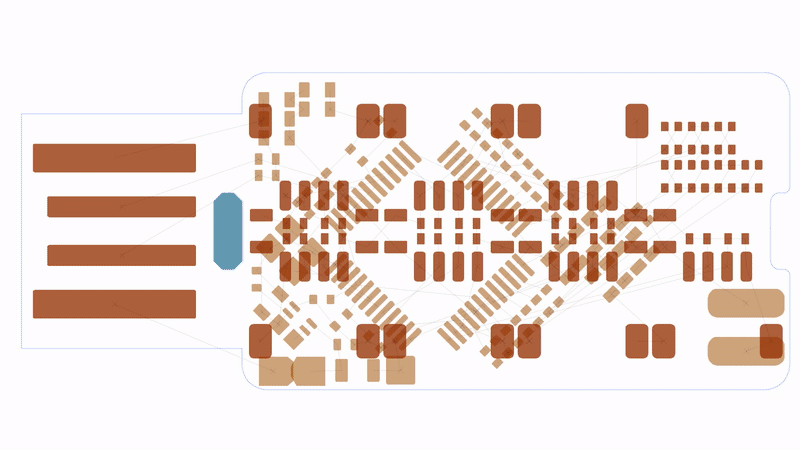
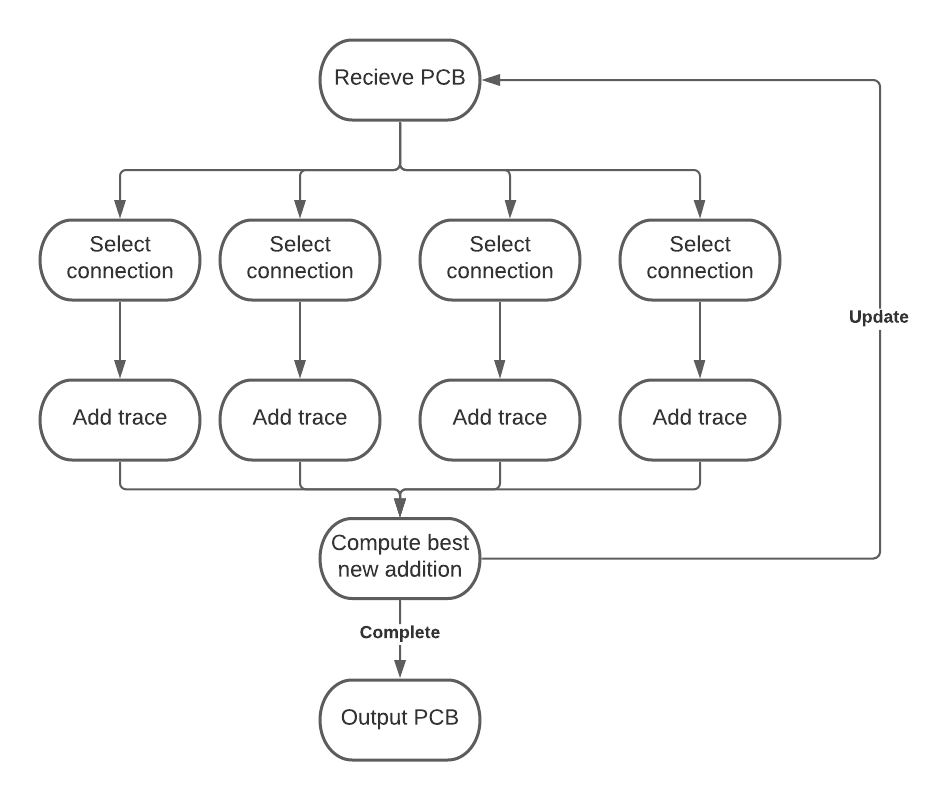

# Parallelized PCB Routing
 
This project aims improve the quality of automatic printed circuit board routing by parralelizing each step and continuously selecting the best results.



### Autorouter
This project uses [freerouting](https://github.com/freerouting/freerouting), an open source autorouting project, to perform each iteration.

A significant issue with the current implementation id that the router tries to select the best connection to route and will only route one connection at a time. This is prone to error and depending on the order traces are routed the routing may fail. This project will help mitigate this issue by having multiple traces routed at the same time before deciding the best path.

## Overview


## Prerquisites

* Java 11+ (available at https://www.oracle.com/java/technologies/downloads/)
* Python 3.6+

## Usage

Run the script with python using the command:
```
python ./route.py
```

## Results

By running significantly more runs each iteration, the script was able to complete the routing of the sample project, while the initial implemantion was not ever able to finish the routing.

## Future work

In the future this could be integrated into the Freerouting project instead of running as a separate script. This would significantly speed up the process, since most of the time was spent reading and saving files.